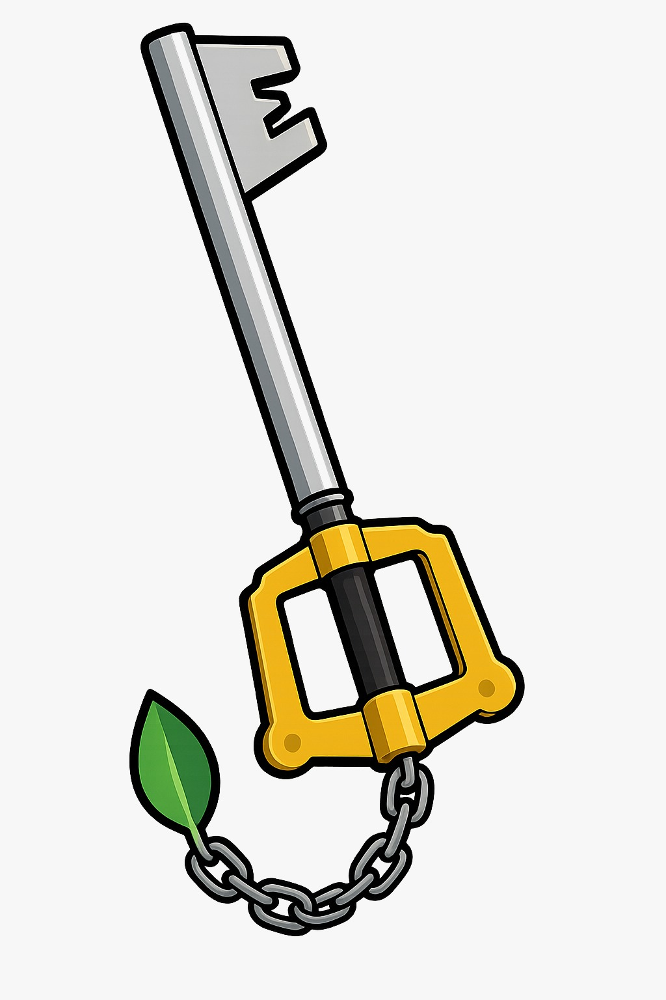

<div align="center">
    <h1>KeybladeDB</h1>
    
    <h3>A web app for videogames research</h3>
</div>

<p align="center">
 <a href="#"></a>
 
</p>
<p align="center">
 <a href="#"></a>
 <a href="#"></a>
</p>

# KeybladeDB
KeybladeDB is a project that aims to research, via webapp, information relating to video games over the years, up to the year 2024. The project was made for the Database II Exam at University of Salerno. This is a first look of the application: 


# Used Technologies
[](https://skillicons.dev) [](https://skillicons.dev) [](https://skillicons.dev) [](https://skillicons.dev)                       

# Creating Virtual Environment
For a better user experience it's recommended to create a virtual environment for the project and activate it before proceeding further. Feel free to use any Python package manager
to create the virtual environment. However, our team decided to use [Conda](https://anaconda.org/). 
Use this command to create an environment:
```
conda create --name env_name
```
And this command to activate the env:
```
conda activate env_name
```

# Cloning Repository
You can download the repo via terminal command doing:
```
git clone https://github.com/Nerone709/KeybladeDB.git
```
Or simply downloading the project as a Zip file. After the download navigate into the folder using the terminal, and write the following command:
```
pip install -r requirements.txt 
```
# Installation Guide

Remind to have python3 installed in your OS. The operation is the same for Windows, Linux and MacOS.

Remind to have MongoDB installed on your pc; if you don't have the application you can install the community edition [here](https://www.mongodb.com/try/download/community).

Open the panel control on MongoDB, and then add the two csv files that you can find into the [project folder](https://github.com/Nerone709/KeybladeDB/tree/main/datasets).

Run the three scripts that you can find [here](https://github.com/Nerone709/KeybladeDB/tree/main/notebooks)

Run the mongoDBConnection.py that you can find into the [scripts folder](https://github.com/Nerone709/KeybladeDB/tree/main/scripts) (this script update the old csv files), and then

run the app.py script to run the server and the web app.

# Functionalities
We decided to implement different functionalities for a better user experience, for example searching a game by name, by genre, by year etc. We also decided to implement a script that would show the margin of improvement in average video game ratings over time; as you can see in the following image:


# Contributors
The project was created, designed and published by: </br>
[Chiara Puglia](https://github.com/chiarapuglia99): Master's Degree Student in Computer Science, Data Science and Machine Learning </br>
[Giuseppe Napolitano](https://github.com/Nerone709): Master's Degree Student in Computer Science, Software Engineering and IT Management </br>
[Luca Giuliano](https://github.com/Kizorat) (Bergor): Master's Degree Student in Computer Science, Data Science and Machine Learning </br>
